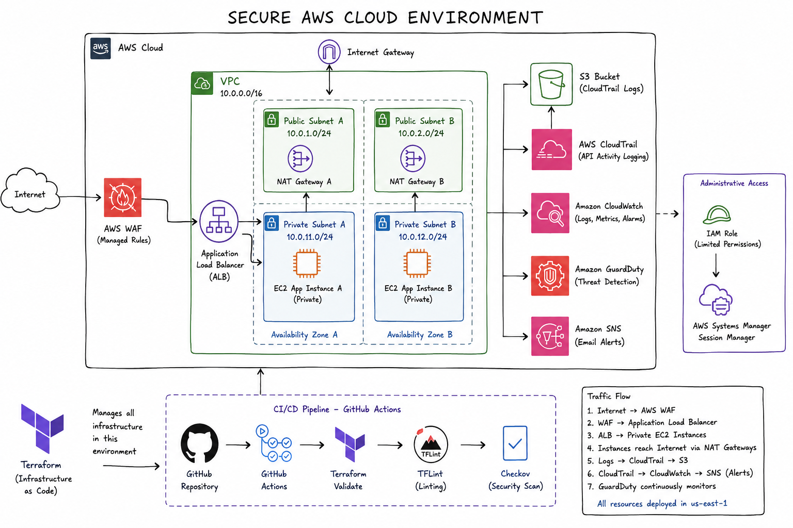

# Secure AWS Cloud Environment Lab

A security-focused AWS cloud environment built with Terraform to demonstrate Infrastructure as Code (IaC), network segmentation, least-privilege access, centralized logging, threat detection, automated alerting, web application protection, incident response, and DevSecOps security scanning.

The project was built as a hands-on cloud security lab and includes a controlled security incident that was introduced, investigated through AWS logging, and remediated through Terraform.

## Architecture



The environment uses a segmented AWS architecture designed to keep application workloads private while exposing only the required public entry point.

### Traffic Flow

Internet → AWS WAF → Application Load Balancer → Private EC2 Instances

### Network Design

- Custom VPC
- Public subnets for the Application Load Balancer
- Private subnets for EC2 application instances
- Internet Gateway for public-facing resources
- Security groups controlling traffic between infrastructure tiers
- EC2 instances without public IP addresses
- AWS Systems Manager Session Manager for administrative access instead of SSH

## Security Controls

### Network Security

- Application instances deployed in private subnets
- No inbound SSH access
- EC2 security group accepts HTTP only from the Application Load Balancer security group
- Public traffic enters through the Application Load Balancer
- AWS WAF protects the application entry point
- AWS Managed WAF rule groups provide common web attack protections

### Identity and Access Management

- IAM role assigned to EC2 instances
- AWS Systems Manager used for remote administration
- No SSH keys required for instance management
- IAM permissions managed through Terraform

### Logging and Monitoring

- AWS CloudTrail records AWS API activity
- CloudTrail logs delivered to a protected S3 bucket
- S3 public access blocking enabled
- S3 versioning enabled
- Server-side encryption enabled
- CloudWatch Log Group receives centralized security logs
- CloudWatch metric filter monitors unauthorized API activity
- CloudWatch alarm provides automated detection

### Threat Detection

Amazon GuardDuty was enabled to provide managed threat detection for the AWS environment.

GuardDuty analyzes AWS telemetry and activity for suspicious behavior and potential security threats.

### Security Alerting

Amazon SNS was integrated with CloudWatch to provide email-based security notifications.

The alerting pipeline was tested by intentionally placing the CloudWatch alarm into the ALARM state and confirming successful email delivery.

### Web Application Firewall

AWS WAF was deployed in front of the Application Load Balancer.

The Web ACL uses AWS Managed Rules including:

- AWSManagedRulesCommonRuleSet
- AWSManagedRulesKnownBadInputsRuleSet

This provides an additional security layer before traffic reaches the application infrastructure.

## Controlled Security Incident

A controlled cloud security incident was performed to demonstrate detection, investigation, and remediation.

### Full Incident Report

A detailed incident report covering the security event, detection gap, investigation, impact, remediation, validation, and lessons learned is available here:

[View the Security Incident Report](security/incident-report.md)

### Incident

The EC2 application security group was intentionally changed through Terraform from:

Application Load Balancer → EC2 port 80

to:

0.0.0.0/0 → EC2 port 80

This created an intentionally over-permissive HTTP rule.

### Investigation

AWS CloudTrail recorded the security group modification through the AuthorizeSecurityGroupIngress API event.

The event provided evidence including:

- Event source
- API action
- AWS Region
- Terraform user agent
- Security group
- Port
- CIDR range
- Timestamp

This demonstrated how AWS API activity can be used to reconstruct a cloud configuration incident.

### Remediation

The insecure Terraform configuration was removed and the original security control was restored.

The EC2 security group was returned to:

Application Load Balancer security group → TCP port 80

A final Terraform plan confirmed:

No changes. Your infrastructure matches the configuration.

This verified that the AWS environment and Terraform configuration had returned to the intended secure baseline.

## DevSecOps CI/CD Security Pipeline

GitHub Actions automatically performs security and configuration checks against the Terraform code.

The pipeline runs on pushes to the main branch and pull requests.

Checkov findings remain visible in the CI pipeline but currently use soft-fail behavior, meaning security findings are reported for review without automatically failing the workflow or blocking merges.

### Automated Checks

- Terraform Format Check
- Terraform Init
- Terraform Validate
- TFLint
- Checkov

Checkov performs static analysis against the Terraform infrastructure and reports additional infrastructure-hardening opportunities.

Security findings are reviewed based on risk and operational impact rather than automatically modifying infrastructure solely to satisfy scanner results.

The CI pipeline performs validation and security analysis only. It does not automatically deploy infrastructure or require AWS credentials.

## Terraform Structure

The infrastructure is organized into reusable Terraform modules.

```text
terraform/
├── environments/
│   └── dev/
└── modules/
    ├── compute/
    ├── iam/
    ├── monitoring/
    ├── security/
    └── vpc/
```

This separates infrastructure responsibilities and makes the environment easier to maintain and expand.

## Technologies

- Amazon Web Services (AWS)
- Terraform
- Git
- GitHub
- GitHub Actions
- Amazon VPC
- Amazon EC2
- Application Load Balancer
- AWS IAM
- AWS Systems Manager
- AWS CloudTrail
- Amazon CloudWatch
- Amazon S3
- Amazon SNS
- Amazon GuardDuty
- AWS WAF
- TFLint
- Checkov
- Linux

## Security Concepts Demonstrated

- Infrastructure as Code
- Defense in depth
- Network segmentation
- Least privilege
- Private workload architecture
- Secure administrative access
- Centralized logging
- Cloud activity auditing
- Threat detection
- Security monitoring
- Automated alerting
- Web application protection
- Static infrastructure security analysis
- CI/CD security controls
- Incident investigation
- Infrastructure remediation
- Configuration drift prevention

## Known Limitations and Production Improvements

This project was designed as a security-focused lab environment rather than a production deployment. Several architectural decisions were made to balance security objectives, project scope, and AWS cost.

For a production environment, additional improvements would include:

- Enforcing HTTPS using an ACM certificate and redirecting HTTP traffic to HTTPS
- Enabling Application Load Balancer access logging
- Enabling AWS WAF logging for additional visibility into web requests
- Using customer-managed KMS keys where stronger encryption control is required
- Further restricting security group egress rules based on application requirements
- Increasing CloudWatch log retention based on organizational compliance requirements
- Implementing additional AWS Config rules for continuous configuration monitoring
- Adding policy-as-code controls to prevent prohibited infrastructure configurations before deployment
- Enforcing pull request reviews and branch protection for Terraform changes
- Configuring Checkov to block CI/CD when defined high-severity security policies fail

These improvements represent potential next steps for evolving the lab architecture toward a production-ready cloud security environment.

## Project Documentation

Detailed implementation notes and evidence are available in:

docs/build-notes.md

Screenshots documenting the build, security controls, monitoring, incident simulation, investigation, remediation, and CI/CD pipeline are stored in:

docs/screenshots/

### Key Evidence

Selected screenshots demonstrating the security implementation and incident-response workflow:

- [Controlled incident Terraform change](docs/screenshots/29-change-alb-security-group.png)
- [CloudTrail incident investigation](docs/screenshots/30-cloudtrail-security-group-incident.png)
- [Live insecure security group configuration](docs/screenshots/31-live-aws-config-with-insecure-state.png)
- [Remediated security group](docs/screenshots/32-security-group-remediated.png)
- [GitHub Actions security pipeline](docs/screenshots/34-github-actions-security-pipeline-success.png)

The complete screenshot collection is available in [docs/screenshots](docs/screenshots/).

## Key Takeaways

This project demonstrates the complete lifecycle of securing cloud infrastructure rather than only deploying AWS resources.

The environment was:

Built → Secured → Monitored → Tested → Investigated → Remediated → Automatically Scanned

Terraform provides repeatable infrastructure management, AWS security services provide visibility and protection, and GitHub Actions adds automated security analysis to future infrastructure changes.

The controlled incident demonstrates how Infrastructure as Code, AWS logging, monitoring, and security controls can work together during a realistic cloud security investigation and remediation workflow.